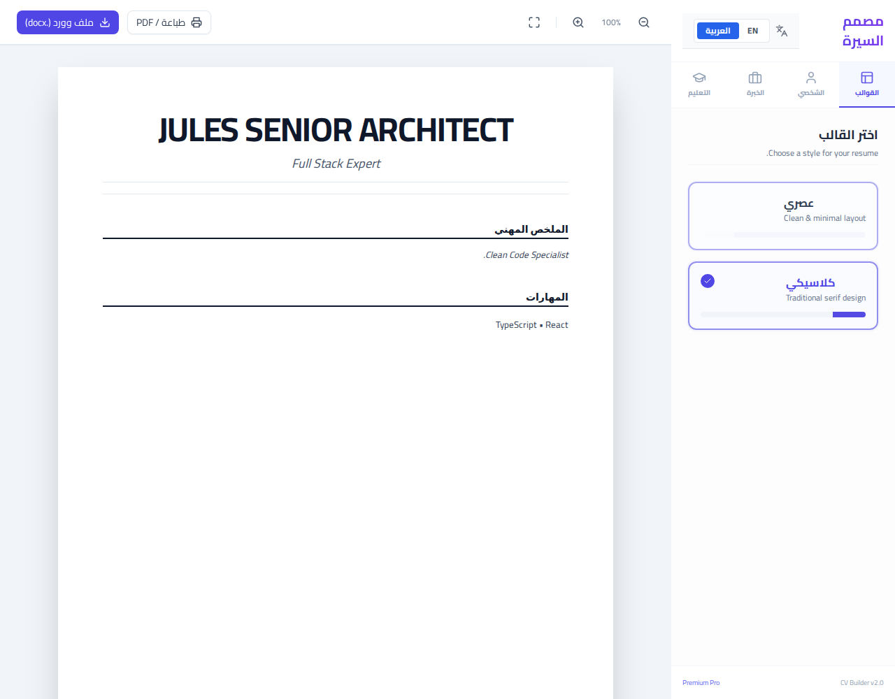

# CV Builder / منشئ السير الذاتية

A modern, bilingual (English & Arabic) CV/Resume builder built with React, Vite, and Tailwind CSS. Create professional resumes in minutes with real-time preview and export options.

منشئ سير ذاتية عصري ثنائي اللغة (إنجليزي وعربي) مبني باستخدام React و Vite و Tailwind CSS. أنشئ سير ذاتية احترافية في دقائق مع معاينة فورية وخيارات تصدير متنوعة.

## 🚀 Features / المميزات

- **Bilingual Support (EN/AR):** Dynamic RTL/LTR layout switching.
- **دعم ثنائي اللغة (عربي/إنجليزي):** تبديل تلقائي للاتجاه (من اليمين لليسار ومن اليسار لليمين).
- **Multiple Templates:** Choose between Modern and Classic designs.
- **قوالب متعددة:** اختر بين التصاميم العصرية والكلاسيكية.
- **Real-time Preview:** See changes as you type.
- **معاينة فورية:** شاهد التغييرات أثناء الكتابة.
- **Export Options:** Print to PDF or export to Word (.docx).
- **خيارات التصدير:** طباعة بصيغة PDF أو تصدير إلى ملف وورد (.docx).
- **Responsive Design:** Works on all screen sizes.
- **تصميم متجاوب:** يعمل على جميع أحجام الشاشات.

## 📸 Preview / المعاينة



## 🛠️ Tech Stack / التقنيات المستخدمة

- **React** - Frontend framework
- **TypeScript** - Type safety
- **Tailwind CSS** - Styling
- **Zustand** - State management
- **Lucide React** - Icons
- **Docx** - Word document generation

## ⚙️ Getting Started / البدء

1. **Clone the repository:**
   ```bash
   git clone <repository-url>
   ```

2. **Install dependencies:**
   ```bash
   npm install
   ```

3. **Run development server:**
   ```bash
   npm run dev
   ```

4. **Build for production:**
   ```bash
   npm run build
   ```

## 📜 Principles / المبادئ

This project follows **SOLID principles**, particularly the Open-Closed Principle, allowing for easy addition of new templates without modifying the core logic.

يتبع هذا المشروع **مبادئ SOLID**، وبالأخص مبدأ (Open-Closed)، مما يسمح بإضافة قوالب جديدة بسهولة دون تعديل المنطق الأساسي.
